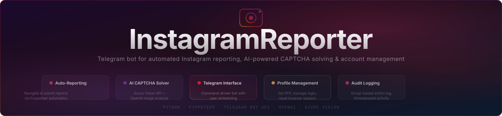

# InstagramReporter

A Telegram bot that automates Instagram reporting workflows using Puppeteer-based browser automation, AI-powered CAPTCHA solving, and user-whitelisted command access.

## Features

- **Auto-Reporting** — Navigates to an Instagram profile and submits reports via keyboard automation (`/bang` command)
- **AI CAPTCHA Solving** — Integrates Azure Computer Vision and OpenAI to analyze and solve image-based CAPTCHAs
- **Telegram Interface** — Command-driven bot with an admin whitelist, group-based audit logging, and conversation state management
- **Profile Management** — Set profile pictures, manage Instagram login sessions, and reset browser state remotely
- **Audit Logging** — Every action is timestamped and forwarded to a designated Telegram group for accountability

## Commands

| Command | Description |
|---|---|
| `/bang <username>` | Begin a reporting sequence against a target Instagram account |
| `/login` | Log in to the configured Instagram account |
| `/reset` | Reset the browser session |
| `/setpfp` | Update the bot's Instagram profile picture |
| `/close` | Close the browser instance |
| `/getid` | Get the current Telegram chat ID |
| `/adduser <id>` | Whitelist a Telegram user (admin only) |
| `/removeuser <id>` | Remove a user from the whitelist (admin only) |

## Setup

```bash
pip install -r requirements.txt
```

Create a `.env` file with the following variables:

```env
TOKEN=<telegram_bot_token>
HOSTUSER=<instagram_username>
HOSTPASS=<instagram_password>
VISION_ENDPOINT=<azure_vision_endpoint>
VISION_KEY=<azure_vision_key>
OPENAI_API_KEY=<openai_api_key>
```

Then run:

```bash
python instabot.py
```

## Stack

- **Python** with `python-telegram-bot`
- **Pyppeteer** (headless Chromium) for browser automation
- **Azure AI Vision** (`quickstart.py`) for image captioning
- **OpenAI** for CAPTCHA grid analysis
- **python-dotenv** for environment configuration
